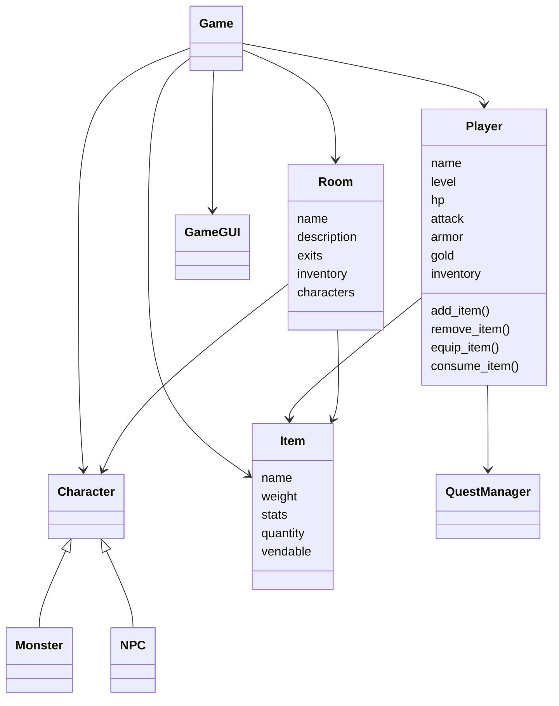

# TBA – Jeu d’aventure textuel (avec interface graphique)

## Présentation générale

**TBA** est un jeu d’aventure et de rôle (RPG) développé en Python. Le joueur explore un univers médiéval-fantastique composé de villages, forêts et donjons à étages, affronte des monstres, collecte des objets, gère son inventaire, améliore son personnage et progresse à travers des quêtes.

Le jeu repose sur :

* un moteur **textuel** (commandes tapées par le joueur),
* une **interface graphique** (Tkinter) pour les combats, l’inventaire, la boutique et l’échange,
* une architecture orientée objet claire et extensible.

---

# Guide utilisateur

## 1. Installation

### Prérequis

* Python **3.10+**
* Aucune bibliothèque externe requise (Tkinter est inclus avec Python)

⚠️ Le jeu utilise Tkinter (interface graphique) et ne peut pas être lancé dans un environnement sans affichage
(comme GitHub Codespaces).  
Pour jouer, lancez le projet sur votre machine locale!!

### Lancer le jeu

```bash
python game_gui.py

```

---

## 2. Univers du jeu

Vous incarnez un aventurier débutant dans un monde médiéval-fantastique.

### Zones principales

* **Village** : point de départ, PNJ, quêtes
* **Forêt** : premiers combats, loot basique
* **Forêt de la capitale** : ennemis plus dangereux
* **Donjon** : progression par étages avec difficulté croissante
* **Guilde** : boutique d’équipement
* **Auberge** : échange / revente d’objets

Chaque étage de donjon possède un **thème cohérent** (morts-vivants, esprits, glace, feu, etc.).

---

## 3. Conditions de victoire / défaite

### Victoire

* Vaincre le **boss final** du donjon
* Compléter les quêtes principales

### Défaite

* Les points de vie du joueur tombent à **0**

---

## 4. Commandes principales

les commandes peuvent etre interactive avec l'interface graphique avec des clique de souris

### Déplacements

* `go nord / sud / est / ouest`
* `go haut / bas`
* `back` : revenir en arrière

### Interactions

* `look` : observer la pièce
* `take <objet>` : ramasser un objet
* `talk <pnj>` : parler à un PNJ

### Inventaire et équipement

* `inventory` : afficher l’inventaire
* `equip <objet>` : équiper un objet
* `unequip <slot>` : retirer un équipement

### Combat

* `attack` : attaquer l’ennemi
* `consommer <objet>` : consommer une potion
* `fuir` : fuire des griffes des monstres


---

## 5. Inventaire et économie

* L’inventaire est **pondéré** (poids maximal)
* Les objets identiques sont **empilés** (ex : `noyau x5`)
* Les monstres droppent des objets vendables
* L’or permet :

  * d’acheter des équipements à la guilde
  * de vendre du loot à l’auberge

### Exemple

* Noyau de monstre : **vendable = 8 or**
* Équipement moyen : **70–120 or**
* Équipement puissant : **120–160 or**

---

## 6. Quêtes

Les quêtes sont gérées par un **QuestManager** :

* objectifs (se déplacer, tuer, obtenir un objet)
* récompenses (or, objets, XP)

Les quêtes guident la progression du joueur dans le monde.

---

#  Guide développeur

## 1. Architecture générale

Le projet est structuré autour de classes indépendantes et cohérentes.

### Modules principaux

* `Game` : logique globale, map, setup
* `Room` : lieux et connexions
* `Player` : joueur, stats, inventaire, combat
* `Item` : objets, équipements, consommables
* `Character` : PNJ et monstres
* `Actions` : commandes du joueur
* `GameGUI` : interface graphique (combat, shop, échange)

---

## 2. Diagramme de classes (Mermaid)



---

## 3. Points techniques importants

* Inventaire basé sur un **dictionnaire avec stacking**
* Système de buffs temporaires (potions)
* Dégâts avec **réduction d’armure progressive**
* Économie centralisée via `vendable`
* GUI découplée de la logique du jeu

---

# Perspectives de développement

Voici des pistes d’amélioration possibles :

### Gameplay

* Classes de personnage (guerrier, mage, voleur)
* Compétences actives et passives
* Arbre de talents
* Boss avec patterns spécifiques

### Technique

* Sauvegarde / chargement de partie
* Génération procédurale de donjons
* Équilibrage automatique via tables de données

### Interface

* Animations de combat
* Journal de combat graphique
* Mini-carte

### Contenu

* Nouvelles quêtes scénarisées
* PNJ avec choix de dialogue
* Fins alternatives

---

## Conclusion

Ce projet pose une base solide pour un RPG en Python, combinant :

* programmation orientée objet,
* logique de jeu complète,
* interface graphique,
* et extensibilité.

Il peut servir aussi bien de **projet pédagogique** que de fondation pour un jeu plus ambitieux.

